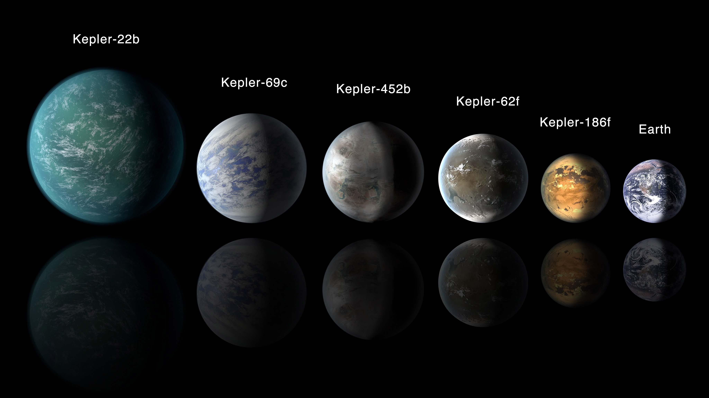

# machine-learning---challenge

# Background

Over a period of nine years in deep space, the NASA Kepler space telescope has been out on a planet-hunting mission to discover hidden planets outside of our solar system.

In order to process this data, we need to create machine learning models capable of classifying candidate exoplanets from the raw dataset.

# Steps
* Preprocess the raw data
* Tune the models
* Compare two or more models

# Preprocess the data
* Preprocess the dataset prior to fitting the model.
* Perform feature selection and remove unnecessary features.
* Use MinMaxScaler to scale the numerical data.
* Separate the data into training and testing data.

# Tune Model Parameters
* Use GridSearch to tune model parameters.
* Tune and compare at least two different classifiers.

# Reporting
* Comparison of each model's performance as well as a summary about the findings and assumptions made based on the models

# Random Forest Model
Best Score: 0.8968144870796614
Random Forest model's best score of 0.8968144870796614 is higher than all other models tested. 

# Neural Networks and Deep Learning Models
The accuracy of Neural Networks model and Deep Learning model is quite close without hyperparameter tuning and less training. Neural Network model: 0.8667048215866089
Deep Learning model: 0.8729977011680603

# SVM Model
Best Score: 0.8733555767397521

# KNN Model
Best Grid Score: 0.8491290439840059

From observation, Random Forest model is better at predicting new exoplanets.

All the models are good for predicting FALSE POSITIVE well with f1-score close to 1.
